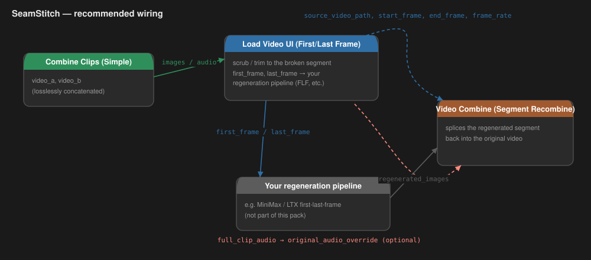
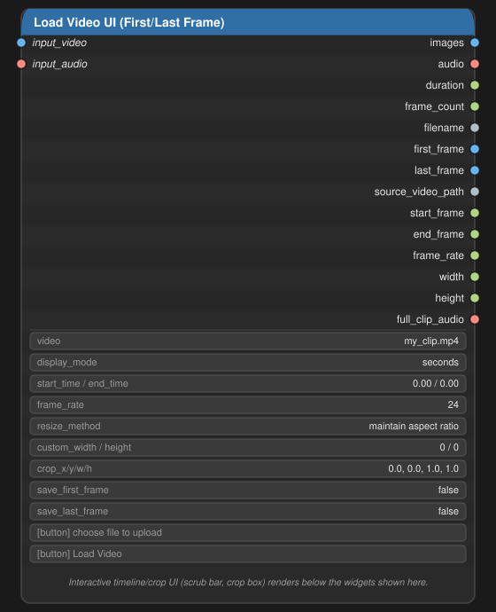
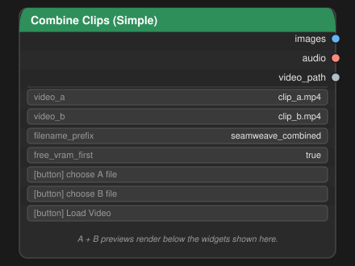
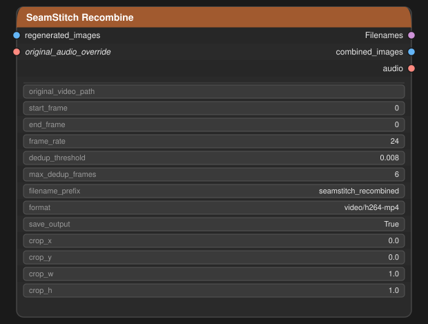

# SeamStitch

Three ComfyUI nodes for a "trim a broken segment out of a video, regenerate it, splice it back
in seamlessly" workflow:

- **Load Video UI (First/Last Frame)** (`LoadVideoUIFirstLast`) — scrub/trim a video with an
  interactive timeline, and get first/last frame outputs for first-last-frame (FLF) generation
  pipelines, plus everything a downstream splice node needs to put the result back.
- **Combine Clips (Simple)** (`SeamweaveSimpleCombine`) — losslessly concatenate two clips
  (container-level stream copy, no re-encode) so the joined file can be reopened and scrubbed for
  bridge/regeneration points.
- **Video Combine (Segment Recombine)** (`VideoSegmentRecombine`) — splice a regenerated
  replacement segment back into the *original* video at the exact frame range it was cut from,
  then encode the result.



> The diagrams in this README are labelled node-layout illustrations, not literal screenshots —
> built that way so no real footage/generation output ships in the repo. Node titles, inputs,
> outputs, and widget names match the actual nodes exactly.

## Requirements

- ComfyUI (a reasonably current version — developed against the 2025/2026-era frontend).
- Python packages: `av`, `numpy`, `torch` (already present in any ComfyUI install), `opencv-python`,
  `pillow`, `aiohttp`. See [requirements.txt](requirements.txt).
- **ffmpeg** on `PATH`, or the `imageio-ffmpeg` package installed (it bundles its own ffmpeg
  binary — this is the easiest route and is included in `requirements.txt`).
- **[ComfyUI-VideoHelperSuite](https://github.com/kosinkadink/ComfyUI-VideoHelperSuite)**
  installed alongside this pack — required for `VideoSegmentRecombine` only (see below). The
  other two nodes have no dependency on it.

## Install

### Option A: ComfyUI Manager

Search for **SeamStitch** in ComfyUI Manager's custom node list and install it, or use
*Install via Git URL* with this repo's URL. Make sure **ComfyUI-VideoHelperSuite** is installed
too (Manager can install it the same way) if you want the segment-recombine node.

### Option B: manual

```bash
cd ComfyUI/custom_nodes
git clone https://github.com/isitrepo/SeamStitch.git
pip install -r SeamStitch/requirements.txt
```

Make sure VHS is a sibling folder in `custom_nodes` too:

```bash
git clone https://github.com/kosinkadink/ComfyUI-VideoHelperSuite.git
pip install -r ComfyUI-VideoHelperSuite/requirements.txt
```

Restart ComfyUI. All three nodes appear under the **SeamStitch** category in the node search
(double-click the canvas and type a node's name, or right-click → Add Node → SeamStitch).

### Dependency: ComfyUI-VideoHelperSuite

`VideoSegmentRecombine` is a fork of ComfyUI-VideoHelperSuite's `VHS_VideoCombine` node and
reuses VHS's own ffmpeg-format handling, encode pipeline, and audio extraction internals
directly (rather than duplicating hundreds of lines of ffmpeg-piping code). At import time it
locates VHS's installed folder automatically — it doesn't matter what that folder is named, it
scans every `custom_nodes` sibling for a `videohelpersuite` package — and adds it to `sys.path`.
**If VHS isn't found, the other two nodes still load normally**; only `VideoSegmentRecombine` is
skipped, with a message naming the problem printed to the console at startup.

## Nodes

### Load Video UI (First/Last Frame)



Pick a video (file dropdown, upload, or drag & drop), trim it with an interactive timeline in
seconds or frames, and optionally crop/resize. Outputs include:

| Output | Notes |
| --- | --- |
| `images` / `audio` | The trimmed segment. |
| `first_frame` / `last_frame` | Single-frame batches from the trimmed range — feed these into a first-last-frame generation node. |
| `source_video_path` | The fully resolved path this node opened — wire into `VideoSegmentRecombine.original_video_path`. |
| `start_frame` / `end_frame` | The frame range (at `frame_rate`) the trim covers, in the *original* video's own timeline. |
| `frame_rate` | Pass-through of the forced extraction rate, so a downstream node decodes on the identical timeline. |
| `width` / `height` | Actual resolution of `images`, read off the output tensor. |
| `full_clip_audio` | The entire source file's audio track, untouched — feed into `VideoSegmentRecombine.original_audio_override` for the final combine. |
| `duration` / `frame_count` / `filename` | Informational. |

An optional `input_video`/`input_audio` pair lets you feed frames in directly from an upstream
node (e.g. `SeamweaveSimpleCombine`) instead of picking a file — the same trim/crop/resize
controls apply to the given frames, no disk round-trip needed.

Two boolean widgets, `save_first_frame` / `save_last_frame`, save the corresponding frame as a
PNG to ComfyUI's output directory.

Based on [WhatDreamsCost-ComfyUI](https://github.com/WhatDreamsCost/WhatDreamsCost-ComfyUI)'s
Load Video UI node, with the outputs above added on top for FLF/splice workflows.

### Combine Clips (Simple)



Concatenates clip A followed by clip B via ffmpeg's concat demuxer (`-c copy`) — a
container-level splice, not a decode/re-encode, so it's near-instant and introduces no
recompression or colour shift. Falls back to a real transcode automatically if the two clips
aren't stream-copy compatible (mismatched codec, frame rate, or audio format). The combined file
is written to ComfyUI's input directory so it can be reopened in **Load Video UI** to pick
bridge start/end points — when both nodes are in the same graph, this node's frontend
auto-selects its output in any connected `LoadVideoUIFirstLast` node once it finishes running.

### Video Combine (Segment Recombine)



Takes a regenerated replacement clip plus the original video path and the frame range that was
cut out of it (wire these straight from **Load Video UI**'s matching outputs), and:

1. Decodes the original video's frames before `start_frame` and after `end_frame`, resized to
   match the regenerated segment's resolution.
2. Drops any held/duplicate frames at the regenerated segment's own leading/trailing edge (a
   keyframe-anchored generation sometimes holds its first/last frame for an extra tick or two,
   which shows up as a stutter at the seam left in).
3. Concatenates `before + deduped_regenerated + after`.
4. Reuses the original video's full audio track end to end (override via
   `original_audio_override` if only the video frames were regenerated and you want to supply
   audio some other way).
5. Encodes the result via ffmpeg.

**Scope vs. the real VHS_VideoCombine:** video formats only (no gif/webp — pipe
`combined_images` into a stock `VHS_VideoCombine` afterward for that), no per-format extra
widgets, no meta-batch/VAE-latent support. This is a full standalone fork focused on the splice
logic, not a wrapper around the stock node.

## Recommended wiring

```
LoadVideoUIFirstLast ──images──────────────────────► (your regeneration pipeline)
                     ──source_video_path───────────► VideoSegmentRecombine.original_video_path
                     ──start_frame─────────────────► VideoSegmentRecombine.start_frame
                     ──end_frame───────────────────► VideoSegmentRecombine.end_frame
                     ──frame_rate──────────────────► VideoSegmentRecombine.frame_rate
                     ──full_clip_audio─────────────► VideoSegmentRecombine.original_audio_override (optional)

(regeneration pipeline output) ───────────────────► VideoSegmentRecombine.regenerated_images
```

`SeamweaveSimpleCombine` feeds `LoadVideoUIFirstLast` too, for picking bridge points out of two
already-concatenated clips before regenerating the segment between them:

```
SeamweaveSimpleCombine ──images/audio──► LoadVideoUIFirstLast.input_video/input_audio
```

See [docs/images/wiring_overview.svg](docs/images/wiring_overview.svg) for the same thing as a
diagram.

## Credits / forked from

This pack builds directly on two other GPL-3.0 projects rather than writing everything from
scratch:

- **[WhatDreamsCost-ComfyUI](https://github.com/WhatDreamsCost/WhatDreamsCost-ComfyUI)** by
  [WhatDreamsCost](https://github.com/WhatDreamsCost) (GPL-3.0) — `LoadVideoUIFirstLast` is a
  fork of its Load Video UI node, with first/last-frame, source-path/frame-index, and
  full-clip-audio outputs added.
- **[ComfyUI-VideoHelperSuite](https://github.com/kosinkadink/ComfyUI-VideoHelperSuite)** by
  [Kosinkadink](https://github.com/kosinkadink) (GPL-3.0) — `VideoSegmentRecombine` is a fork of
  its `VHS_VideoCombine` node's encode pipeline, and is also a runtime dependency for that one
  node (see above).

If you use SeamStitch, consider starring/crediting those two projects as well.

## Status

Prototype-stage nodes, developed and tested manually against real footage but not yet published
to the Comfy Registry. Issues and PRs welcome.

## License

GPL-3.0-or-later (see [LICENSE](LICENSE)) — required by this pack's direct reuse of code from
the two GPL-3.0 projects above.
