# SeamStitch

ComfyUI nodes for one job: **cut a broken or awkward stretch out of a video, regenerate it, and splice
it back in so the join is invisible.** Mark the stretch on a timeline, let your generator (LTX,
MiniMax…) fill it, and SeamStitch puts the result back into the *original* footage at the exact frames,
with picture and audio kept in sync, then saves it and tells you how smooth the joins are.

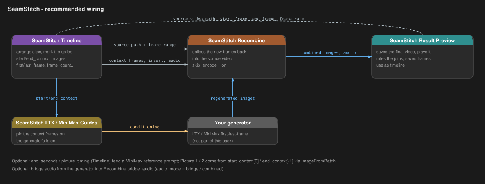

| Node | What it is for |
| --- | --- |
| **SeamStitch Timeline** | The editor. Arrange and trim clips, mark the range / cut / gap to regenerate. Outputs everything the generator and Recombine need. |
| **SeamStitch Recombine** | Splices the regenerated frames (and audio) back into the source video. |
| **SeamStitch Result Preview** | Saves the final video, plays it with the new span marked, rates the joins. |
| **SeamStitch LTX Guides** / **MiniMax Guides** | Pin the real frames around the gap onto the generator's latent, so motion carries through the join. |
| *SeamStitch Loader* and *SeamStitch Combine* | **Legacy** — the original two-node way in, replaced by the Timeline. Still supported; see [Legacy nodes](#legacy-nodes). |

> The diagrams here are labelled layout illustrations, not screenshots (so no real footage ships in the
> repo). The per-node ones are generated from a running ComfyUI's own `/object_info` by
> [`docs/gen_diagrams.py`](docs/gen_diagrams.py), so sockets and widget defaults cannot drift from the code.

## Install

Requirements: ComfyUI; Python packages `av`, `opencv-python`, `pillow`, `aiohttp`, `imageio-ffmpeg`
([requirements.txt](requirements.txt)); ffmpeg (bundled via `imageio-ffmpeg`, or on `PATH`); and
**[ComfyUI-VideoHelperSuite](https://github.com/kosinkadink/ComfyUI-VideoHelperSuite)** for Recombine and
Result Preview (the other nodes work without it).

```bash
cd ComfyUI/custom_nodes
git clone https://github.com/isitrepo/SeamStitch.git
pip install -r SeamStitch/requirements.txt
git clone https://github.com/kosinkadink/ComfyUI-VideoHelperSuite.git   # if not already installed
```

Or use ComfyUI Manager → *Install via Git URL* with `https://github.com/isitrepo/SeamStitch.git`. Restart
ComfyUI; the nodes appear under **SeamStitch** (double-click the canvas and search). If VHS is missing,
only Recombine and Result Preview are skipped, with a startup warning.

## Quick start

1. **Timeline:** drag your video(s) onto the node. Press **I** / **O** at the start and end of the bad
   stretch (or click **✂** on a join between two clips → *bridge this cut*).
2. Wire the Timeline to your generator (`first_frame` / `last_frame`, or `start_context` / `end_context`
   through a Guides node; `frame_count` → the generator's length).
3. Wire the Timeline **and** the generator's output into **Recombine** (turn `skip_encode` on), then
   Recombine → **Result Preview**. Queue.
4. Read the verdicts in Result Preview; loop the joins; save a frame or send the result back to the
   Timeline for the next fix.

---

## SeamStitch Timeline

A one-track editor that replaces the old Combine → Loader pair: the strip *is* the combine, the marked
splice *is* the trim. Controls follow [comfyui-obvpm-timeline](https://github.com/chanon/comfyui-obvpm-timeline)
(GPL-3.0); the splice model underneath is SeamStitch's own.

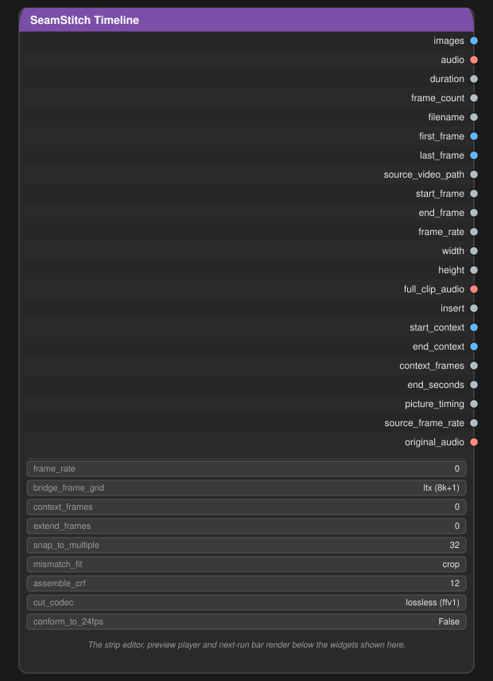
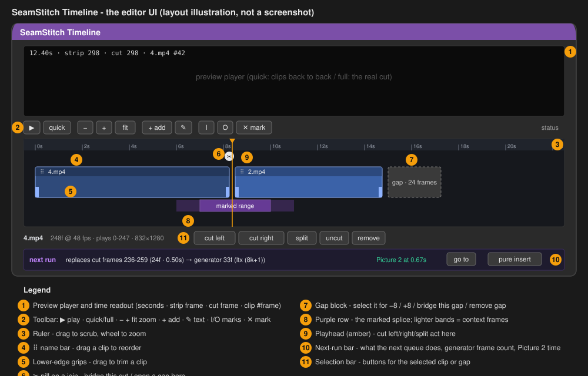

### What the controls do

| Control | What it does |
| --- | --- |
| **▶** / Space | Play / pause the preview. |
| **quick / full** | *quick* plays the clips back to back from their files. *full* has the server build the real cut — the file Recombine will splice — and plays that. |
| **− / + / fit** | Zoom the strip out / in / to fit. (Wheel over the ruler also zooms.) |
| **+ add** | Add a video from the input folder or upload one. (You can also drag files onto the node.) |
| **✎** | Edit the strip as text: one line per clip, `path @ enter..exit` (plays frames enter..exit-1), or `~ N` for an N-frame gap. |
| **I** / **O** | Mark the start / end of the range to regenerate at the playhead. |
| **✕ mark** | Clear the marked splice. |
| Drag a clip or the ruler | Scrub. Wheel over the picture steps one frame (shift: 10). ←/→ step a frame, Home/End jump (keys work only while the pointer is over the node). |
| **⠿ name bar** (on a clip) | Drag to reorder clips. |
| **Lower edge grips** (on a clip) | Drag to trim the clip. |
| **cut left / cut right / split** | With a clip selected: start it at the playhead / end it at the playhead / split it in two there. |
| **uncut** / **remove** | Play the clip in full again / take it off the strip (the file stays). |
| **✂ pill** (on a join) | **bridge this cut** (regenerate N frames each side of the join) or **open a gap here** (insert new frames). |
| **Gap block** | Select it: **−8 / +8** change its length, **bridge this gap** adds I/O markers either side, **remove gap** closes it. |
| Purple row under the strip | The marked splice. Drag along it to mark a range, drag its edges to adjust; lighter bands are `context_frames`. Markers snap to whole frames. |
| **next run** bar | Says what the next queue will do and how many frames the generator will be asked for (using `bridge_frame_grid`, `context_frames`, `extend_frames`), and **"Picture 2 at N s"**. **go to** jumps the playhead there; **mark around it** / **pure insert** switch a gap between the two modes below. |

### Marking one splice (one at a time)

| You mark… | Mode | Result |
| --- | --- | --- |
| a **range** (I/O) | replace | The range is replaced by the generated frames. |
| a **cut** (✂ → *bridge this cut*) | replace | N frames either side of the join are regenerated — by far the best way to smooth a hard cut. |
| a **gap**, no markers (✂ → *open a gap here*) | insert | Nothing is removed; the gap's new frames go between two kept frames. The generator is asked for gap + 2 (its first and last frame are the kept ones; Recombine drops them again). |
| a gap **with I/O markers either side of the join** | replace | The footage across the join **plus** the gap's frames is regenerated (the Loader's `extend_bridge`). |
| a gap with markers **on its own edges** | insert | Same as a pure insert. |

### Widgets

| Widget | Meaning |
| --- | --- |
| `frame_rate` | Frame rate of the cut and of every frame number on the strip. `0` = the first clip's own. |
| `bridge_frame_grid` | The generator's frame grid: `ltx (8k+1)`, `minimax (17k+5)` or `none`. `frame_count` is rounded **up** onto it for a range/cut, to the **nearest** length for a gap. |
| `context_frames` | K real frames either side of the range go to `start_context` / `end_context`; `frame_count` grows by 2K. See [Motion guides](#motion-guides). |
| `extend_frames` | Ask the generator for this many frames *more* than the marked range (before grid rounding). The video gets longer by the difference. |
| `snap_to_multiple` | Round the `width` / `height` outputs to this multiple (32: 1080 → 1088). `0` = off. |
| `mismatch_fit` | When clips differ in size each is fitted onto the **first** clip's: `crop` fills and trims, `pad` letterboxes. |
| `cut_codec` | How a multi-clip strip is assembled. `lossless` (FFV1, default): exactly the decoded clips, no colour shift, but big (~1.6 GB/min at 832×1280). `h264`: small, one lossy generation. The browser always plays a small H.264 copy. |
| `assemble_crf` | Quality of the `h264` cut (default 12; lower = better). |
| `conform_to_24fps` | Off by default. MiniMax H3 runs on a fixed 24 fps clock, so a 25 fps cut drifts its lips ~4% ahead of the speech. On: every frame kept and labelled 24 fps, audio slowed to match (pitch kept). Pair it with Result Preview's restore. See [24 fps conform](#24-fps-conform-minimax-h3). |
| *(hidden)* `sequence`, `target` | The strip and the marked splice — edited by the UI, not typed. |

The cut goes to `input/seamstitch_timeline/`, cached by content. A strip that is **one untouched clip at
its own frame rate** is passed through as the file itself, with no re-encode.

### Outputs

The Timeline's outputs are the Loader's 18, in the Loader's order (so it drops in where the Loader was),
computed on the assembled cut, plus four appended at the end.

| Output | What it is for |
| --- | --- |
| `images` / `audio` | The marked segment (replace mode) or the two kept anchor frames (insert). |
| `first_frame` / `last_frame` | Single frames at each end of the range — wire into a first/last-frame generator. |
| `duration` / `frame_count` | What to ask the generator for, in seconds / frames (grid-snapped, plus extensions and context). Wire `frame_count` into the generator's length. |
| `filename` | Informational. |
| `source_video_path` | The cut file — wire into Recombine's `original_video_path` and Result Preview. |
| `start_frame` / `end_frame` | The frame range being replaced, on the cut's timeline. |
| `frame_rate` | The cut's frame rate — keep it the same downstream. |
| `width` / `height` | Generate at exactly this size. |
| `full_clip_audio` | The whole cut's audio, untouched — wire into Recombine's `original_audio_override`. |
| `insert` | `true` in insert mode — wire into Recombine's `insert`. |
| `start_context` / `end_context` / `context_frames` | The real frames either side of the range, and K — see [Motion guides](#motion-guides). |
| **`end_seconds`** | Time of the generator's last frame, `(frame_count − 1) / frame_rate`: when "Picture 2" must appear in a MiniMax reference prompt. |
| **`picture_timing`** | A ready-made prompt alignment line with that number filled in; put it in front of your scene text so the time never goes stale when markers, gap, extension or grid change. |
| **`source_frame_rate`** | The strip's own frame rate before any conform (`frame_rate` is the cut's: 24 when conformed). Wire into Result Preview's `source_frame_rate`. |
| **`original_audio`** | The cut's audio at the source rate, unstretched. Wire into Result Preview's `original_audio` so the restored video keeps the real sound. |

### 24 fps conform (MiniMax H3)

MiniMax H3 has no frame-rate input. It takes frames 1:1 but times the reference audio and the
prompt's Picture timings on a fixed 24 fps clock. On 25 fps footage the lips ran ahead of the speech,
by about 6 frames over an 8 s chunk.

With `conform_to_24fps` on, a non-24 fps strip is cut **frame for frame** and labelled 24 fps:
- a single untouched clip is re-labelled by stream copy (no re-encode at all);
- a multi-clip strip is encoded at 24 with the same frames;
- the audio is slowed by 24/fps (25 fps: 4%) with the pitch kept, exactly `frames / 24` s long.

Frame numbers don't change, so markers, ranges, `context_frames` and grid rounding are the same as
without the conform. `frame_rate`, `duration`, `end_seconds` and `picture_timing` come out on H3's
clock: `(frame_count − 1) / 24`.

Then wire `source_frame_rate` and `original_audio` into Result Preview and leave its
`restore_source_frame_rate` on. The saved video comes back at the source frame rate and length, with
the original audio outside the regenerated span. Under the new frames it keeps the span's own audio
(the bridge's, or the source's), sped back up.

Tested on 25 fps. 30 fps is a 20% stretch and untested. Don't use `frame_rate = 24` for this: that
**resamples** (drops one frame in 25).

### Motion guides

A first/last-frame model told only *where* each end must be eases into its endpoint and stops, then the
real footage carries on at full speed — a visible "still, then suddenly moving" at the join. With
`context_frames = K` the generator also gets **K real frames each side** of the cut, so it knows how fast
things are moving there.

- Pin them with **LTX Guides** or **MiniMax Guides** (below). The generated clip is K context + the new
  frames + K context; Recombine drops the K context frames at each end (they are still in the output as
  the real footage), so only the new frames land in the gap.
- Wire the `context_frames` output into Recombine's `context_frames`. Replace mode only; with K = 0
  `start_context` / `end_context` are just `first_frame` / `last_frame`, so the Guides nodes can always
  be wired in. The clip needs K spare frames either side or the node raises.

---

## SeamStitch Recombine

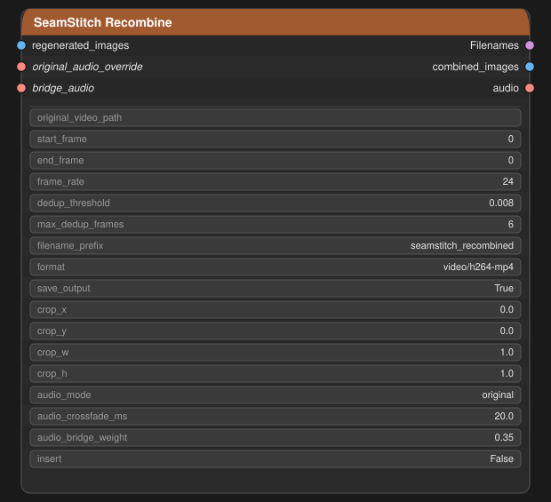

Splices the regenerated clip back into the **original** video at the frame range it was cut from, then
(optionally) encodes it. The source is the resolution ground truth: output is always the source's size and
the untouched footage is never cropped or rescaled. If the regenerated frames come back a different size
(normally just `snap_to_multiple` rounding) only those frames are resized, with a console note and a
warning if the aspect ratio is >3% off.

**Steps:** decode the footage before `start_frame` and after `end_frame` → (insert mode only) drop the
regenerated clip's first and last frame → drop held/duplicate frames at its edges → concatenate → cut the
audio at the same frames so sound and picture stay in sync → encode.

### Inputs

| Input | Meaning |
| --- | --- |
| `regenerated_images` | The generator's output. |
| `original_video_path`, `start_frame`, `end_frame`, `frame_rate` | Wire from the Timeline's `source_video_path`, `start_frame`, `end_frame`, `frame_rate`. |
| `dedup_threshold` (0.008) | Mean pixel difference (0–1) below which adjacent frames at the clip's edges count as held duplicates. |
| `max_dedup_frames` (6) | Cap on how many leading/trailing frames can be stripped as duplicates. |
| `filename_prefix`, `format`, `save_output` | Output file name, VHS format (default `video/h264-mp4`), and whether to save or keep temp only. |
| `original_audio_override` *(opt.)* | Replaces the source's audio — wire the Timeline's `full_clip_audio`. Must be on the source's own timeline. |
| `bridge_audio` *(opt.)* | Audio generated with the frames (e.g. LTX-2.5 via `LTXVAudioVAEDecode`). Resampled to the source, never time-stretched. |
| `audio_mode` | What plays under the new frames: `original` (source audio for the frames that survived), `bridge` (`bridge_audio`; if it runs short the tail falls back to the source), `combined` (original plus `bridge_audio` mixed on top at `audio_bridge_weight`). |
| `audio_crossfade_ms` (20) | Length-preserving equal-power crossfade at each non-continuous audio join, so a mid-waveform cut can't click. |
| `audio_bridge_weight` (0.35) | Level of `bridge_audio` in `combined` mode. |
| `insert` | Off: the new frames **replace** `[start_frame, end_frame]`. On: they are **inserted** at the join and nothing is removed (`end_frame` may equal `start_frame − 1`); the clip's first/last frame are always dropped; the gap's audio is `bridge_audio` or silence — never the source's audio from around the join. Needs ≥ 3 frames. Wire from the Timeline's `insert`. |
| `context_frames` | Wire from the Timeline's `context_frames`: drops K frames from each end of the clip before anything else. Replace mode only. |
| `skip_encode` | Splice only: no video is written (`Filenames` is empty). Turn on when Result Preview saves the video, so it isn't encoded twice. |

If you extend the bridge (longer than the original gap), set `audio_mode` to `bridge` or `combined` —
`original` plays silence under the extra frames.

### Outputs

| Output | Meaning |
| --- | --- |
| `Filenames` | The written video (VHS type) — wire to Result Preview's `filenames` if you did *not* use `skip_encode`. |
| `combined_images` | The spliced frames — wire to Result Preview's `images`. |
| `audio` | The spliced audio — wire to Result Preview's `audio`. |

Encoding: video formats only (no gif/webp — pipe `combined_images` into a stock VHS Video Combine for
those). The format's own settings (e.g. `crf`, `pix_fmt`) are handed to the encoder when supplied by name;
before 0.3.0 an empty dict was passed, so every encode was the format default (h264 crf 19). For settings
in the UI, let **Result Preview** do the save.

---

## SeamStitch Result Preview

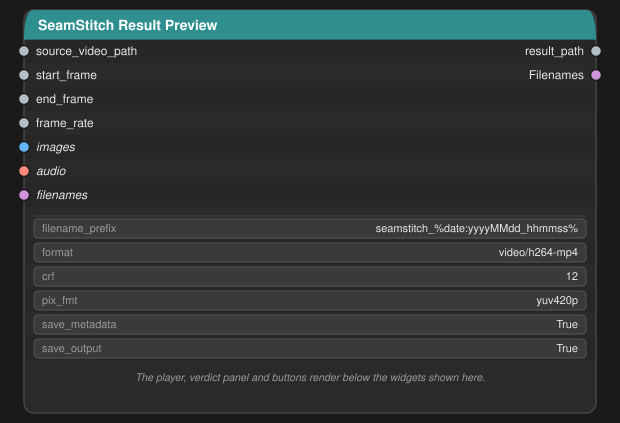
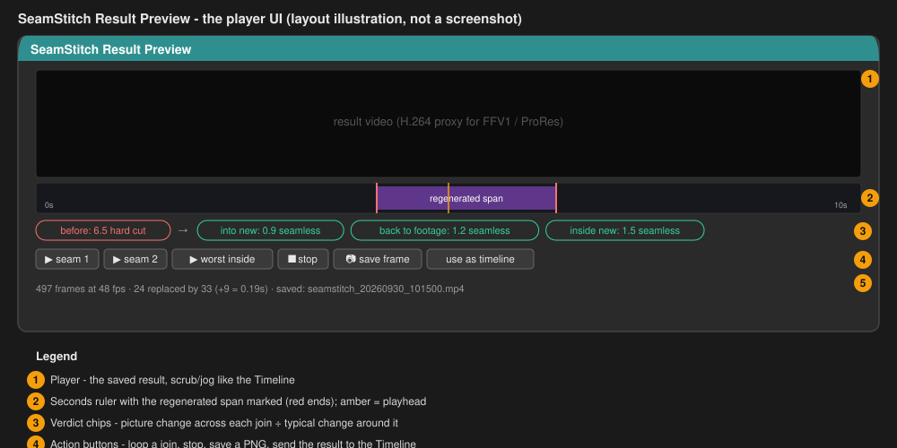

Saves the final video, plays it with the regenerated span marked, and rates the joins.

### Inputs

| Input | Meaning |
| --- | --- |
| `source_video_path`, `start_frame`, `end_frame`, `frame_rate` | From the Timeline (or Loader): where the new frames sit. |
| `images` *(opt.)* | Recombine's `combined_images` (with `skip_encode` on): this node saves the final video. |
| `audio` *(opt.)* | Recombine's `audio`, muxed in when `images` is wired. |
| `filenames` *(opt.)* | Instead of `images`: a video Recombine (or VHS) already wrote — shown and rated, not re-encoded. |
| `filename_prefix` | Default `seamstitch_%date:yyyyMMdd_hhmmss%` (date-stamped, as in VHS). Used when `images` is wired. |
| `format` | VHS's own formats and encode path; `h264-mp4` is pixel-identical to VHS Video Combine. 4:2:0 formats cost ~1–2 colour levels on re-encode; for a master with none use `video/ffv1-mkv` (16-bit RGB, lossless) or `video/ProRes` (written as 4444). Those play here through an H.264 proxy. |
| `crf` (12) | h264/h265/webm quality; lower = better, 0 = lossless. |
| `pix_fmt` | `yuv420p` (plays everywhere) or `yuv420p10le` (10-bit gradients; h264/h265 only). |
| `save_metadata` | Embed the workflow in the video, as VHS does. |
| `save_output` | On: save to the output folder. Off: temp only. |
| `source_frame_rate` *(opt.)* | The Timeline's `source_frame_rate`. When it differs from `frame_rate` (the cut was conformed to 24 fps for MiniMax H3), the restore below applies. |
| `original_audio` *(opt.)* | The Timeline's `original_audio`: the unstretched sound the restored video keeps outside the new frames. |
| `restore_source_frame_rate` | Default on; only used when the rates differ. Saves the same frames at the source frame rate (the source cut's exact length for a length-keeping splice) with the original audio, and the new span's own audio sped back up under it. Given `filenames`, the picture is re-labelled by stream copy into `<name>_<fps>fps` beside it, with no re-encode. The verdicts and the player use the restored file. Off: saved as it comes, at 24 fps with the slowed audio. |

### Outputs

| Output | Meaning |
| --- | --- |
| `result_path` | Path of the saved (or shown) video. |
| `Filenames` | VHS filenames, so you can chain another VHS node. |

### What the verdicts mean

Each join is scored as the picture change across it ÷ the typical (75th-percentile) change in the 24
frames around it: under **1.8 seamless**, under **3.0 soft bump**, otherwise **hard cut**. Three joins are
rated — **into** the new frames, **back** to the footage, **inside** the new frames (the worst step) — and
the same measure on the original range is shown as **before**. Ordinary motion peaks at about 1.3–1.7; a
hard cut reads ~6.5. It rates motion continuity, not picture quality — a plain crossfade reads seamless.

### Buttons

| Button | What it does |
| --- | --- |
| **▶ seam 1 / ▶ seam 2** | Loop a second either side of the join into the new frames / back to the footage. |
| **▶ worst inside** | Loop around the biggest picture change inside the new frames. |
| **■ stop** | Stop looping. |
| **📷 save frame** | Save the frame under the playhead as a PNG in `output/seamstitch_frames`, colour-converted from the saved video — use it as a first/last-frame reference instead of a screen grab. |
| **use as timeline** | Put the result on the Timeline as its only clip so the next splice starts from it. |

The seconds ruler, drag-to-scrub and wheel-to-jog work as on the Timeline.

---

## SeamStitch LTX Guides

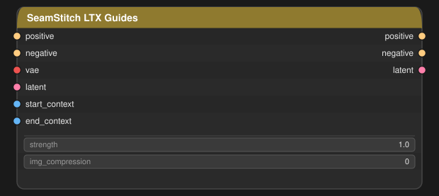

For LTX-2.x. Takes `positive` / `negative` / `vae` / `latent` like `LTXVAddGuide` plus the Timeline's
`start_context` / `end_context`, and pins every frame as its own single-frame guide: `start_context[i]` at
frame `i`, the last `end_context` frame on the video's last frame and the rest just before it. It replaces
the usual pair of `LTXVAddGuide` nodes (frame 0 and −1) — at `context_frames` 0 it does exactly that.
`LTXVCropGuides` strips its guides downstream like any others.

Single-frame guides because LTX only accepts a 9+ frame guide starting at frame 8k+1, so no multi-frame
guide can end on the last frame of an 8k+1 video.

| Input | Meaning |
| --- | --- |
| `strength` (1.0) | Guide strength, applied to every pinned frame. |
| `img_compression` (0) | `LTXVPreprocess` compression on each frame first; leave 0 if the frames already went through one. |

Outputs: `positive`, `negative`, `latent`. Needs a ComfyUI with LTX support; without it only this node is
skipped.

## SeamStitch MiniMax Guides

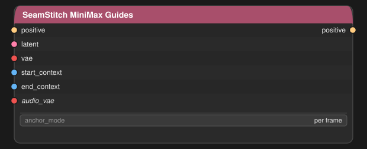

The MiniMax H3 counterpart, through core ComfyUI's `MiniMaxH3AddGuide`. Inputs: `positive`, `latent`,
`vae`, `start_context`, `end_context`, `anchor_mode`, and an optional `audio_vae` (not needed for image
anchors). Output: `positive`.

| `anchor_mode` | Meaning |
| --- | --- |
| `per frame` (default) | Every context frame is its own single-frame anchor, at any K. Places frames exactly like the LTX node. |
| `clip` | Each side is one multi-frame clip anchor (H3's native motion anchor, fewer tokens) — only for K = 5, 22, 39… (**17k+5**); other K is refused. |

Set the Timeline's `bridge_frame_grid` to `minimax (17k+5)` so `frame_count` lands on H3's grid.
For `MiniMaxH3ReferenceToVideo`'s reference images ("Picture 1" / "Picture 2" in the prompt), take
`start_context` frame 0 and `end_context` frame −1 with core **ImageFromBatch** (index 0 and −1, length 1);
this node has no image outputs on purpose (they made a dependency cycle). `end_seconds` /
`picture_timing` from the Timeline give the time "Picture 2" must appear. Needs a ComfyUI with MiniMax
H3 support; without it only this node is skipped.

---

## Legacy nodes

The Timeline replaces these, and its outputs match the Loader's, so a graph built on the Loader still
works unchanged. Wiring for the old way:

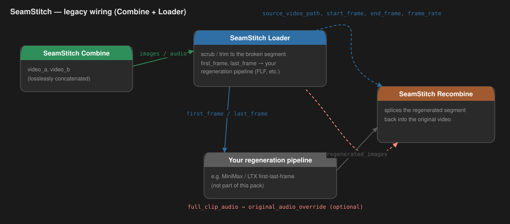

### SeamStitch Loader (legacy)

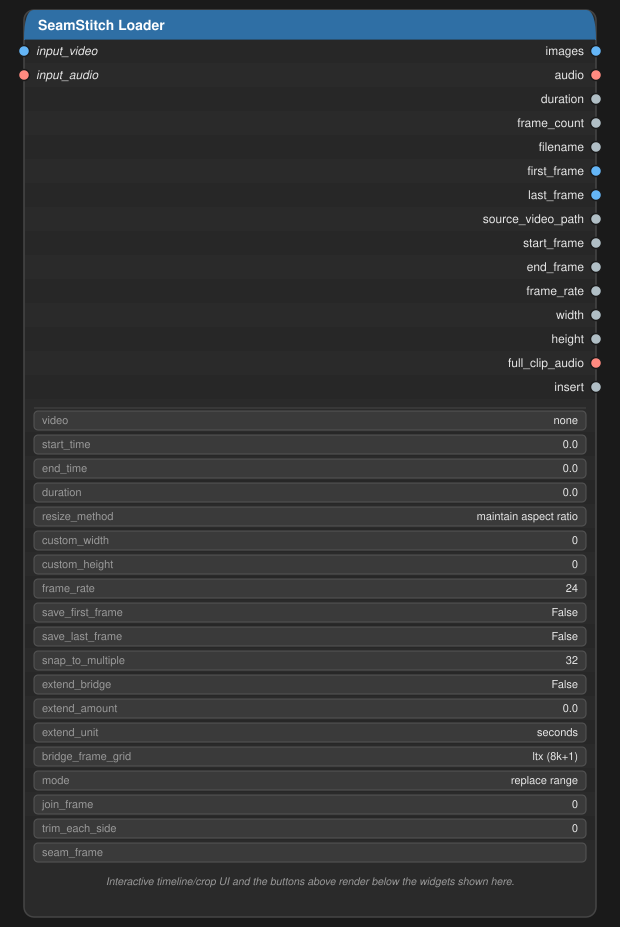

Pick a video (dropdown, upload, or drag & drop), trim it on an interactive timeline in seconds or
frames, optionally crop/resize, and get the segment plus everything Recombine needs. It has the same 18
outputs the Timeline reproduces (table above), except there is no `end_seconds` / `picture_timing`;
`source_video_path` is the file it opened and `full_clip_audio` the whole file's audio. An optional
`input_video` / `input_audio` pair takes frames from an upstream node (e.g. Combine) instead of a file.

| Widget | Meaning |
| --- | --- |
| `video`, `start_time` / `end_time` / `duration` (or frames) | The file and the trim range; **Time / Frames** toggle on the timeline. |
| `resize_method`, `custom_width` / `custom_height`, `crop_*`, `snap_to_multiple` | Crop/resize; width/height outputs snap to the multiple. |
| `frame_rate` | Forced extraction rate; passed through so downstream decodes the same timeline. |
| `save_first_frame` / `save_last_frame` | Save that frame as a PNG in the output folder. |
| `extend_bridge`, `extend_amount`, `extend_unit` | Report `duration` / `frame_count` as the gap **plus** this much, so the generator gets more room than the original gap left. `images` etc. are unaffected. |
| `bridge_frame_grid` | `ltx (8k+1)`, `minimax (17k+5)`, `none`. Replace mode: rounds up (only with `extend_bridge`). Insert mode: snaps to the nearest length. |
| `context_frames` | Motion guides — see [Motion guides](#motion-guides). Replace mode only. |
| `mode` | `replace range` (default) or `insert at join`. |
| `join_frame`, `trim_each_side` | Insert mode: the bridge goes between frames `join−1` and `join`; `trim_each_side` N removes `[join−N, join+N−1]` (0 removes nothing). |
| `seam_frame` *(opt. input)* | Wire Combine's `seam_frame`; overrides `join_frame`. |

In insert mode `first_frame` / `last_frame` are the two **kept** frames either side of the removed
range, `images` is just those two anchors, `start_frame` / `end_frame` are `join−N` / `join+N−1`, and the
typed `duration` is the bridge length you want (snapped to the grid). Insert mode is the right tool for
**extending a shot**; to join two clips use replace mode over the seam (measured on the same hard cut:
insert max per-frame change 60.09 vs replace 14.93).

**Frame accuracy.** The Loader's replace mode used to drift — an exactly-equal frame time was skipped and
the next one doubled, and a range lost its last frame. Targets now derive from the frame count, the same
rule Recombine decodes with. Files coded as RGB (FFV1) and files with millisecond timestamps (MKV) decode
exactly (also in Recombine and the Timeline).

Based on [WhatDreamsCost-ComfyUI](https://github.com/WhatDreamsCost/WhatDreamsCost-ComfyUI)'s Load Video
UI node.

### SeamStitch Combine (legacy)

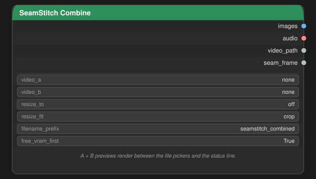

Concatenates clip A then clip B by **stream copy** (ffmpeg concat, no re-encode — near-instant, no
recompression or colour shift), so the joined file can be reopened in the Loader to pick bridge points.

| Widget / output | Meaning |
| --- | --- |
| `video_a`, `video_b` | The two clips. Must match in resolution (unless `resize_to`) and in whether they have audio — a mismatch raises. |
| `resize_to` | `off` (default: refuse a resolution mismatch), `match_a` / `match_b`: resize the other clip onto that one (aspect kept, never stretched). Forces a transcode. |
| `resize_fit` | With a resize: `crop` (default — fill the frame, trim the overhang) or `pad` (fit inside, black bars). |
| `filename_prefix`, `free_vram_first` | Output name; unload models first (this node has no upstream dependencies). |
| `images` / `audio` | The combined clip. |
| `seam_frame` | Index of clip B's first frame in the file, **measured** from the written file (raises rather than emit an unverified number). Wire into the Loader's `seam_frame`. |

If the frame rates differ, or the stream-copied audio fails to decode, it falls back to a real transcode
(constant frame rate). The file is written to the input folder, and in the same graph the node
auto-selects it in any connected Loader.

---

## Credits

SeamStitch builds on other GPL-3.0 projects:

- **[WhatDreamsCost-ComfyUI](https://github.com/WhatDreamsCost/WhatDreamsCost-ComfyUI)** by
  [WhatDreamsCost](https://github.com/WhatDreamsCost) — the Loader is a fork of its Load Video UI node.
- **[ComfyUI-VideoHelperSuite](https://github.com/kosinkadink/ComfyUI-VideoHelperSuite)** by
  [Kosinkadink](https://github.com/kosinkadink) — Recombine is a fork of `VHS_VideoCombine`'s encode
  pipeline; Recombine and Result Preview depend on VHS at runtime.
- **[comfyui-obvpm-timeline](https://github.com/chanon/comfyui-obvpm-timeline)** by
  [chanon](https://github.com/chanon) — the idea and control set behind the Timeline and Result Preview.
  The code here was written independently for SeamStitch's splice model.

Please consider starring or crediting those projects too.

## Status

Early-stage. The Loader, Combine, Recombine, Timeline and Result Preview have been used on real footage;
the LTX and MiniMax guide nodes are newer and have had less real-render testing. Not yet in the Comfy
Registry. Issues and PRs welcome.

**Upgrading from v0.1.0** — two breaking changes: Recombine's `crop_x` / `crop_y` / `crop_w` / `crop_h`
widgets are gone (a saved graph's Recombine values shift by position — re-check `audio_mode`,
`audio_crossfade_ms`, `audio_bridge_weight` and `insert`, or re-add the node), and Combine's `video_path`
output is gone (wire the Loader's `source_video_path` into `original_video_path`). See the
[changelog](docs/CHANGELOG.md).

## License

GPL-3.0-only (see [LICENSE](LICENSE)) — required by this pack's direct reuse of code from the GPL-3.0
projects above.
